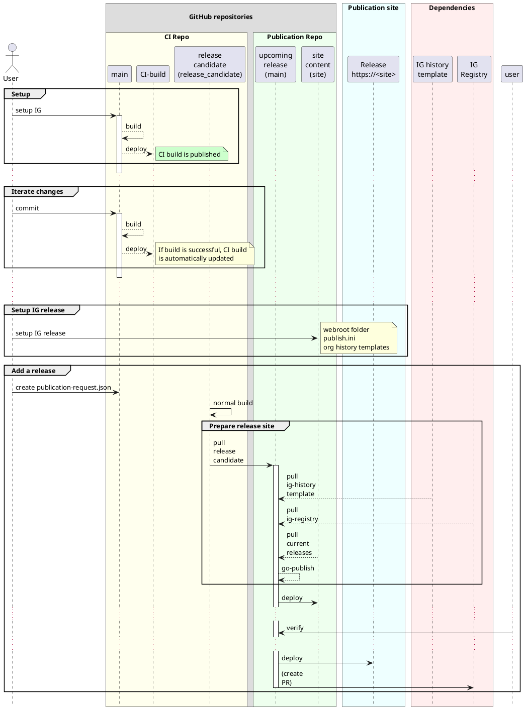

# Publication of specifications

The publication of specifications is a final step after the the CI build is OK.

It follows the process described in the [FHIR wiki](https://confluence.hl7.org/display/FHIR/Maintaining+a+FHIR+IG+Publication) and requires some preparatory actions:
1. Establishing a set of repositories and branches to support the different steps, enable some automation while allowing human control over the entire process
1. setting up the supporting content for the IG publication steps.
1. preparing the site(s) where the IG content will be published - CI-build and releases

