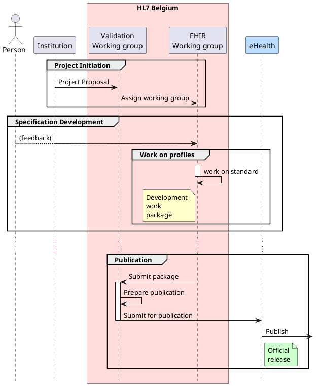

# Publication

The publication process starts with a [project initiation](project_initiation.html) phase, which starts with a proposal that describes the content, and is evaluated by the working parties.

This proposal, which can be submitted by any institution, is validated by the HL7 Validation Working Group, which designates and/or summons one of the [HL7 Belgium FHIR Working Groups](hl7_be_wgs.html) for working on the artifacts. 

